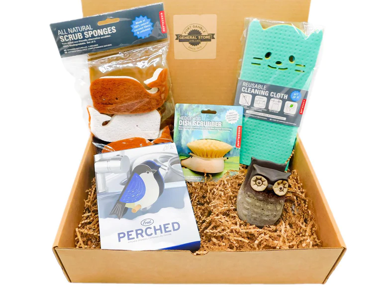

# Treasures and Trinkets Project

Melanie Vera's shop, _Treasures and Trinkets_, is taking off! Since starting her store 5 years ago, she's now opened in multiple locations and is moving into online and telesales. In her store, she sells "Treasure Boxes," which are gift boxes with a special theme. She packages these boxes and then sends them out via the mail.

|                            |
| :--------------------------------------------------------------------------------: |
| _Image from [Port Gamble General Store](https://www.portgamblegeneralstore.com/)._ |

Melanie wants you to help her improve her business by analyzing the customer data from the store. She would like to do things like:

- Get all the customer emails so she can send out thank you messages.
- Get all the customer names so she can customize her thank you emails.
- Count how many treasure boxes she’s sold.
- Figure out how much revenue has been made.
- Learn which treasure box that was sold is the most expensive.
- Figure out which state has the most customers.
- Learn which sales associate has made the most sales.

Below, you will see a complete list of the functions Melanie would like you to build.

This is the second project of the course. Please read carefully through the instructions and rubric below.

## Project scoring

This project has two different parts on which you will be graded. Each part is weighted differently.

- 70% of the project is scored on **completion**.
- 30% of the project is scored through the **mastery rubric**.

In total, you must receive at least 70% to complete this project. For example, you could attain 60% of points through the completion requirements and 10% of points through the mastery rubric.

### Completion

Each function you complete within the three files located in the `src/` folder must be completed in full. If the function you write passes all of the tests, you will receive full credit. If your function passes some of the tests, you will receive partial credit.

If you get stuck on a particular function, feel free to move on to another function and return to it at a later time.

#### Collect

Build functions to collect some helpful information.

1. Complete the `getAllCustomerEmails()` function.
1. Complete the `getAllCustomerFullNames()` function.
1. Complete the `getCountOfAllCustomerTransactions()` function.
1. Complete the `getUniqueListOfAllCustomerStates()` function.
1. Complete the `getCountOfAllProductsPurchased()` function.
1. Complete the `getTotalRevenueOfAllProductsSold()` function.
1. Complete the `getUniqueListOfAllAssociateStoreLocations()` function.
1. Complete the `getMostExpensiveTreasureBox()` function.

#### Find

All of these functions use parameters to find specific data.

9. Complete the `findCustomerById()` function.
1. Complete the `findCustomerByFullName()` function.
1. Complete the `findAssociateById()` function.
1. Complete the `findAllCustomersByState()` function.
1. Complete the `findAllCustomersHelpedByAssociate()` function.
1. Complete the `findAllCustomersWhoBoughtSpecificBox()` function.

#### Transform

All of these functions rework the existing data into a new shape. Transformations are important in coding as they can help answer a broader range of questions. For example, even though the data you are given is by customer, you can reshape the data to be by associate or by product.

15. Complete the `transformToAssociateByIdAndSaleTotal()` function.
1. Complete the `transformToAssociateByIdWithTransactionIds()` function.
1. Complete the `transformToAssociateByIdAndCustomerMiniProfile()` function.
1. Complete the `transformToProductByNameAndCustomerMiniProfile()` function.

### Mastery rubric

Beyond getting the tests to pass, you must build your skills to write good code that follows best practices. To view components of the mastery rubric, view the appropriate assignment on Canvas.

## Existing data

The `data/data.json` file contains the data used by the functions. This data is used in the tests. If you'd like, you can also copy this data to the `index.js` file and assign it to a variable. You can then test out your functions in the `index.js` file by following the instructions there.

All of the functions search through the existing data in the `data/data.json`. You can open this file and look at the data at any time.

The data is an array of objects. Each object represents a customer.

The object has the following keys:

- **id**: _(string)_ A unique identifier for the customer.
- **email**: _(string)_ The customer's unique email address.
- **username**: _(string)_ The customer's unique username.
- **profile**: _(object)_ Represents personal information about the customer.
  - **name**: _(object)_
    - **first**: _(string)_ The customer's first name.
    - **last**: _(string)_ The customer's surname.
- **company**: _(string)_ The customer's employer.
- **dob**: _(string)_ The customer's date of birth in the format _yyyy-mm-dd_.
- **address**: _(object)_ Represents the customer's overall address.
  - **line1**: _(string)_ The customer's street address.
  - **line2**: _(string)_ The customer's apartment or unit number, if applicable.
  - **city**: _(string)_ The customer's city.
  - **state**: _(string)_ The customer's state.
- **transactions**: _(array of objects)_ Represents a single transaction the customer made.
  - **id**: _(string)_ A unique identifier for the transaction.
  - **products**: _(array of objects)_ All products sold within the transaction.
    - **id**` _(string)_ A unique identifier for the product.
    - **productName**: _(string)_ The name of the treasure box product.
    - **priceInCents**: _(number)_ The cost of the treasure box in cents.
  - **associate**: _(object)_ The associate who helped with the transaction.
    - **id**: _(string)_ A unique identifier for the associate.
    - **email**: _(string)_ The associate's company email.
    - **storeLocation**: _(string)_ The city and state where the associate is located.
    - **name**: _(object)_
      - **first**: _(string)_ The associate's first name.
      - **last**: _(string)_ The associate's surname.
    - **dob**: _(string)_ The associate's date of birth in the format _yyyy-mm-dd_.

## Run the tests

If you press the "Run" button on Replit, all of the tests will run for this project. However, there are _many_ tests in this project, so you may find it difficult to understand the test output if you run all of the tests.

Instead of pressing the green "Run" button, change to the tab that says "Shell". You will see a command line interface. If you wish to run the tests for a single file, you will need to use this interface while following the instructions below.

### Run a single test file

While in the "Shell" interface, type the following and then press the "Enter" key.

```
npm test 01
```

You should see the tests run, as you are used to seeing. However, if you scroll up to the top of the output, you should see that _only_ the `__tests__/01-search.test.js` file ran.

You can replace `01` with the number of your test file. For example, if you want to run the tests for `03-transform.js` file, you can run the following command:

```
npm test 03
```
